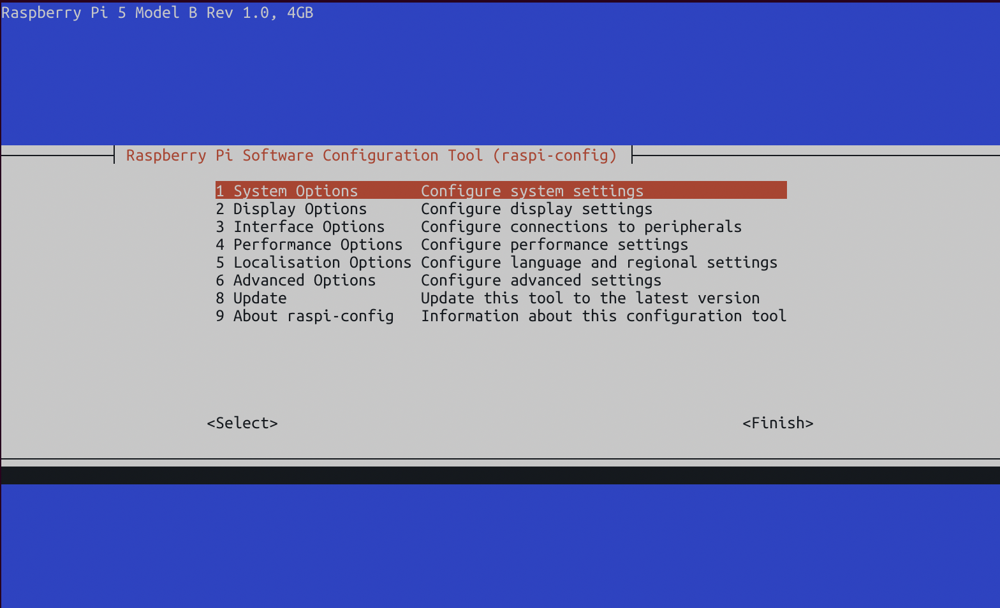

# User Guide

Welcome! This instruction file assumes no prior knowledge of this repository and is meant as a guide on how to set the project up. If you are looking for implementation details, go to [developers.md](./developers.md).

## Overview
This project is split into two parts:

1) [Hardware Setup](#hardware) - this includes wiring and connections

2) [Software Setup](#software) - this includes setting up the program environment

## Hardware
This section covers the necessary hardware and how to put them together!

### Components
- [Raspberry Pi 5](https://www.adafruit.com/product/5813)
- MicroSD Card compatible with a Raspberry Pi 5
- Raspberry Pi 5 power cable
- Computer monitor
- HDMI to Micro HDMI cable
- Keyboard
- [Slamtec C1 RPLIDAR](https://www.slamtec.com/en/C1)
- [MEETOOT Ultrasonic Piezoelectric Tweeter Horn](https://a.co/d/iI9qoRT)
- Breadboard jumper wires or Dupont alligator clips

### Putting the Pieces Together
1) Use the USB cord in the Slamtec box to connect the Slamtec to the Raspberry Pi.

2) Connect the Piezo horn's two output receivers to physical pins 9 (ground) and 12 (GPIO 18). Solder jumper wires to the horn's receivers or use alligator clips.
> Note it does not matter which horn receiver you connect the Piezo Horn's ground or power to.

3) Connect the Raspberry Pi to a power source and get ready to set up the software!

 


## Software
This section covers how to set up the Raspberry Pi to run the program. There are a lot of steps and it is important to follow them in order if you are not familiar with working with a Raspberry Pi. 

### Flashing the Raspberry Pi 5
1) [Download Raspberry Pi OS Imager](https://www.raspberrypi.com/software/)

2) Choose Device > Raspberry Pi 5

3) Choose OS > Raspberry Pi OS (other) > Raspberry Pi OS Lite (64-bit)

4) Choose the relevant SD card, flash, and insert into the Raspberry Pi 5

### Setting up the Raspberry Pi 5
1) Connect the Raspberry Pi 5 to the keyboard and monitor using the HDMI to Micro HDMI cable

2) On startup, create your username and password. **Remember these!**

3) Open the Pi settings and set the following options:
```sh
sudo raspi-config
```
   - System Options > Wireless LAN > connect to your local WiFi
   - Interface Options > SSH enable



4) Update your Pi
```sh
sudo apt update && sudo apt upgrade -y
```

### Setting up the Program Environment

1) Download the repository
```sh
sudo apt-get install git
git clone https://github.com/awnder/rplidar_sdk_chicken.git
```

2) Download and install WiringPi
```sh
# fetch the source
sudo apt install git
git clone https://github.com/WiringPi/WiringPi.git
cd WiringPi

# build the package
./build
cd debian-template

# install it
sudo apt install wiringpi-3.0-1.deb
```

### Running the Program
1) Go to the `rplidar_sdk_chicken.git` directory
```sh
# move to directory
cd rplidar_sdk_chicken.git

# build the program
make
```


### Setting up Remote Connection
1) Initialize a Wifi hotspot. Replace `<hotspot name>` and `<hotspot pswd>` with the desired name and password for the hotspot:
```sh
sudo nmcli device wifi hotspot ssid <hotspot name> password <hotspot pswd> ifname wlan0
```
> Note the UUID! It will appear as a long sequence of letters and digits like: xxxxxx-xxxxxx-xxxxx-xxxxxxx

> Note the IPv4 address of the new wlan0 connection! It should like 10.42.0.1 or 192.168.1.1

2) Autoconnect and start hotspot across Raspberry Pi reboots, replacing `<hotspot UUID>` with the UUID you took note of:
```sh
sudo nmcli connection modify <hotspot UUID> connection.autoconnect yes
sudo nmcli connection modify <hotspot UUID> connection.autoconnect-priority 100
sudo nmcli connection up <hotspot UUID>
```

3) Edit `systemd-rfkill` to turn off rfkill because it clears the hotspot on each reboot.
```sh
sudo systemctl edit systemd-rfkill
```

4) Add the following to the top of the file:
```sh
[Service]
ExecStart=
ExecStart=/usr/sbin/rfkill unblock all
```

5) Reboot the Raspberry Pi to activate the rfkill changes:
```sh
sudo reboot now
```

6) Connect to your newly created Wifi hotspot using your computer and SSH into the Pi (you [enabled ssh](#setting-up-the-raspberry-pi-5) right?). Replace `<username>` and `<ip address>` with the username you created and the ip address you noted down.
```sh
ssh <username>@<ip address>
```